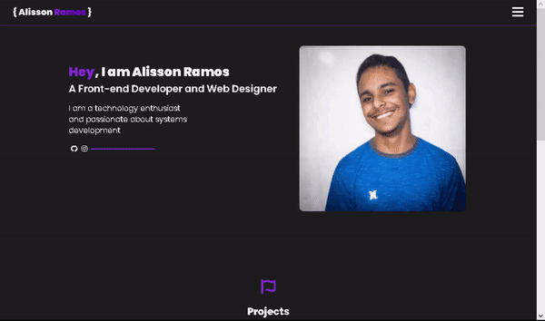

# Portifolio 


## ✨ Sobre ✨

<p id="sobre">Esse é um projeto feito por mim nas férias para treino de alguns conteudos aprendido em aula, além de servir como um portifolio meu.</p>

---

## ⚙️ Instalação ⚙️
 
<br>

### Iniciando no Navegador: 

<a href="https://alisson-ramos.github.io/Portifolio/"> Clique aqui para ir para a página no Github.io</a>

<br>

### Inciando na sua maquina:

<ul>
    <li>Baixe ou clone o Projeto no seu computador</li>
</ul>

```bash
  $ git clone https://github.com/AlissonForbidden/Portifolio.git
```

<ul>
    <li>Após isso só iniciar no seu editor de Código</li>
    <li>Recomendo o Visual Code</li>
</ul>


---

## 🖥️ Tecnologias 🖥️

<br>

   

---

## 📷 Imagem do projeto 📷

<br>

<P align="center"></P>


---

<h4 align="center">🔨 Projeto Portifolio 🚀 em Desenvolvimento 🔨</h4>

---
